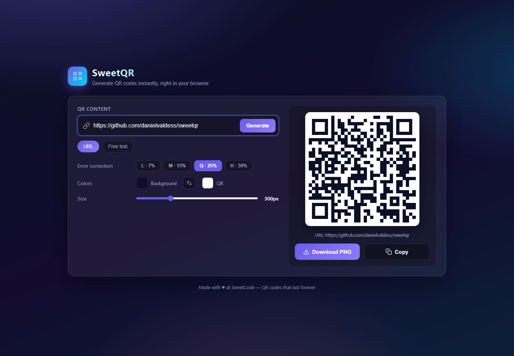
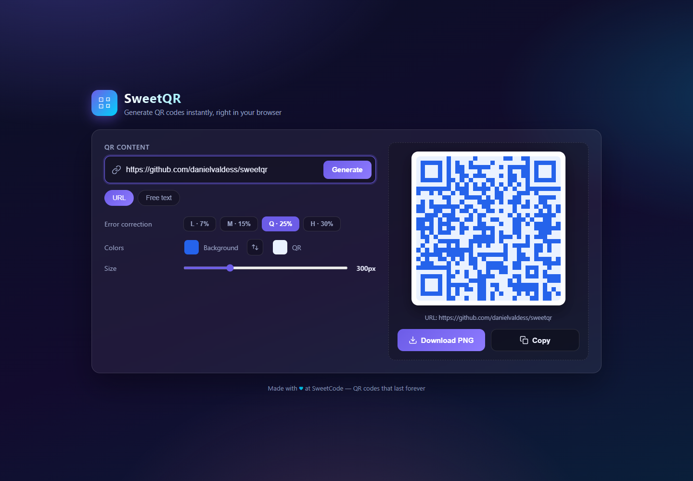
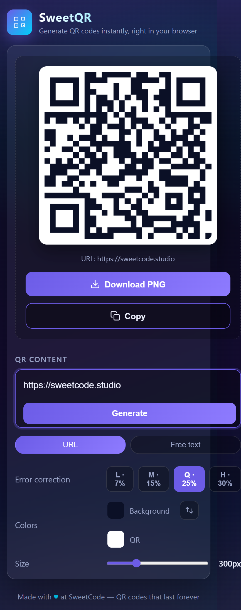

<p align="center">
  
</p>

<h1 align="center">SweetQR</h1>

<p align="center">
  <b>A QR code generator — web + CLI.</b><br/>
  The web app has no backend: the QR is generated instantly in your browser.
</p>

<p align="center">
  
  
  
  
  
</p>

<p align="center">
  <a href="https://danielvaldess.github.io/sweetqr/"><b>Live demo</b></a>
</p>

---

## What is it?

**SweetQR** generates QR codes two ways:

- a **web app** (`index.html`) that renders the QR live in the browser — no server,
  no tracking, nothing leaves your device; and
- a **CLI** (`cli/sweetqr.py`) that saves a PNG from the terminal.

Made with ♥ at **SweetCode**.

## Screenshots

**Web app** — live preview while you type, with mode, error correction, colors and size.



**Custom colors** — pick the background and QR colors (or swap them) for branded codes.



**Responsive** — works on mobile.

<p align="center"></p>

## Features

- **Live preview** as you type.
- **URL mode** (auto-adds `https://` if missing) or **free text**.
- **Error correction** levels: L (7%) · M (15%) · Q (25%) · H (30%).
- **Custom colors** for background and QR, with a one-click swap.
- **Adjustable size** (180–620 px) and **high-res PNG download** (1024 px).
- **Copy to clipboard** as an image.
- **Privacy-first:** generated client-side, no CDNs, `noindex` + `robots.txt`.
- **CLI** for scripted/terminal use.

## Web app

The whole app is static — HTML + JS + the `qrcodejs` library bundled in `vendor/`.
It works with any static file server.

```bash
python3 server.py              # http://127.0.0.1:8080
# or with zero installs:
python3 -m http.server 8080
```

## CLI

```bash
python3 -m pip install qrcode pillow
python3 cli/sweetqr.py
```

It asks for the URL (adds `https://` if missing) and a file name, then saves the
PNG to `generados/`.

## Project structure

```
sweetqr/
├── index.html        # web app (UI + logic)
├── server.py         # minimal static server (binds to 127.0.0.1)
├── favicon.svg       # cherry favicon
├── robots.txt        # blocks search engines
├── vendor/
│   ├── qrcode.min.js # QR library (qrcodejs, MIT)
│   └── LICENSE
├── cli/
│   └── sweetqr.py    # terminal version
└── docs/screenshots/ # README images
```

## Deployment

**GitHub Pages (web app):** the site is published at
<https://danielvaldess.github.io/sweetqr/>.

**cloudflared (private/internal):** inside the SweetCode network, serve on
localhost and expose it through a tunnel so only people with the link can use it.

```bash
git clone https://github.com/danielvaldess/sweetqr.git /opt/sweetqr
cd /opt/sweetqr
nohup python3 server.py --host 127.0.0.1 --port 8080 &

cloudflared tunnel create sweetqr
cloudflared tunnel route dns sweetqr sweetqr.sweetcode.studio
cloudflared tunnel run sweetqr
```

`config.yml`:

```yaml
tunnel: sweetqr
credentials-file: /root/.cloudflared/<tunnel-id>.json
ingress:
  - hostname: sweetqr.sweetcode.studio
    service: http://127.0.0.1:8080
  - service: http_status:404
```

## Security & privacy

- No tracking, no analytics; the QR is generated **client-side**.
- **No external CDNs** — the QR library is vendored locally (`vendor/`).
- The server binds to `127.0.0.1` by default; expose it only through a tunnel.
- `noindex, nofollow` + `robots.txt` keep it out of search engines.

## Author

**Daniel Valdés** — [LinkedIn](https://linkedin.com/in/daniel--valdes) · [GitHub](https://github.com/danielvaldess)

---

<p align="center"><sub>Made with ♥ at SweetCode</sub></p>
